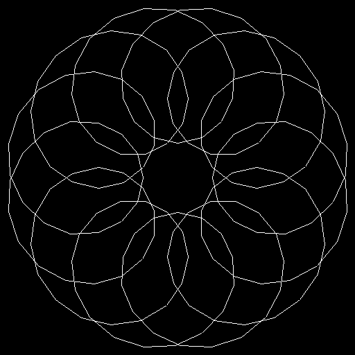
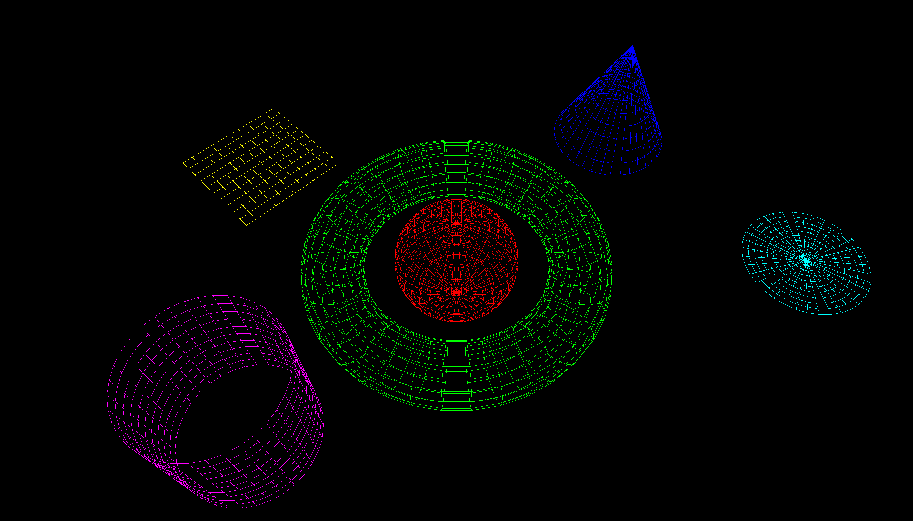
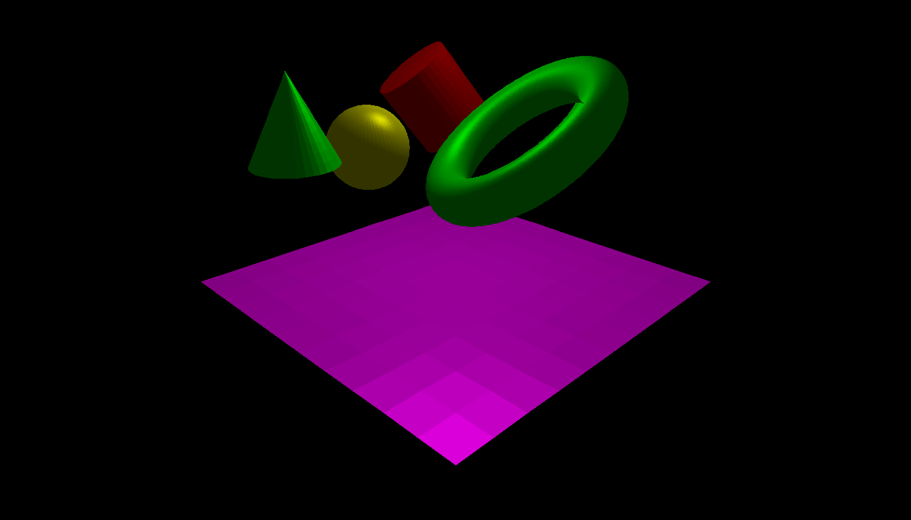

# Computer Graphics Exploration

## Part 1
This project generates an image using mathematical functions and a custom graphics library. The main script, `test1.py`, creates a graphical representation of a parametric equation.
<p align="center">
  
</p>

#### Files
- **`test1.py`**: The main script that generates the image.
- **`graphicsWindow.py`**: Contains the `graphicsWindow` class used for drawing and saving the image.
- **`matrix.py`**: Contains the `matrix` class used for matrix operations.

#### Usage

1. **Install dependencies**: Ensure you have the required dependencies installed. You can install them using pip:
   ```bash
   pip install numpy pillow
   ```
Run the script: Execute the main script to generate the image:
   ```bash
   python testAssignment1.py
  ```
Output: The script will generate an image file named testImage.png and display it.

The main script testAssignment1.py demonstrates how to use the graphicsWindow and matrix classes to generate an image based on a parametric equation.

This script creates a window, calculates points based on the parametric equation, and draws lines between these points to form a pattern. The resulting image is saved as testImage.png and displayed.

---
## Part 2
This project visualizes various mesh 3D parametric objects using a custom graphics library. The objects include planes, circles, spheres, cones, cylinders, and tori. The visualization is rendered in a graphics window with a specified camera view.
<p align="center">
  
</p>


The project consists of the following files:

- `cameraMatrix.py`: Defines the camera matrix for setting up the viewing system.
- `graphicsWindow.py`: Manages the graphics window where objects are rendered.
- `matrix.py`: Provides matrix operations.
- `object.py`: Defines the base class for 3D objects.
- `parametricCircle.py`: Defines the parametric circle object.
- `parametricCone.py`: Defines the parametric cone object.
- `parametricCylinder.py`: Defines the parametric cylinder object.
- `parametricObject.py`: Defines the base class for parametric objects.
- `parametricPlane.py`: Defines the parametric plane object.
- `parametricSphere.py`: Defines the parametric sphere object.
- `parametricTorus.py`: Defines the parametric torus object.
- `point.py`: Defines the point class.
- `test2.py`: Main script to set up and render the 3D objects.
- `transform.py`: Provides transformation operations.
- `UsingTheParametricSphereClass.py`: Example usage of the parametric sphere class.
- `UsingTheTransformClass.py`: Example usage of the transform class.
- `vector.py`: Defines the vector class.
- `wireMesh.py`: Manages the wire mesh representation of objects.

#### Usage

1. **Install Dependencies**: Ensure you have Python installed. Install any required libraries using `pip`.
   ```bash
   pip install numpy matplotlib
   ```
2. **Run the Script**: Execute the `test2.py` script to render the 3D objects.
    ```sh
    python test2.py
    ```

3. **Output**: The script will open a graphics window displaying the 3D objects and save an image named `testImage2.png`.


#### Main Script (`test2.py`)

- **Imports**: The script imports necessary classes and functions from various modules.
- **Camera Setup**: Defines the camera parameters and sets up the camera view using `cameraMatrix`.
- **Object Attributes**: Defines the transformation, color, reference points, and dimensions for each 3D object.
- **Object Initialization**: Initializes each parametric object with the defined attributes.
- **Rendering**: Creates a `wireMesh` of the objects and renders them in the graphics window. The rendered image is saved and displayed.

---
## Part 3
This project demonstrates the creation and rendering of 3D parametric objects using Python. The code generates a scene with various 3D objects, applies transformations, and renders the scene to an image file.

<p align="center">
  
</p>

#### Files

- `cameraMatrix.py`: Defines the `cameraMatrix` class for the camera viewing system.
- `graphicsWindow.py`: Handles the creation of the graphics window and drawing operations.
- `lightSource.py`: Defines the `lightSource` class for light source properties.
- `matrix.py`: Provides matrix operations.
- `object.py`: Base class for 3D objects.
- `parametricCircle.py`: Defines a parametric circle.
- `parametricCone.py`: Defines a parametric cone.
- `parametricCylinder.py`: Defines a parametric cylinder.
- `parametricObject.py`: Base class for parametric objects.
- `parametricPlane.py`: Defines a parametric plane.
- `parametricSphere.py`: Defines a parametric sphere.
- `parametricTorus.py`: Defines a parametric torus.
- `point.py`: Defines a point in 3D space.
- `tessel.py`: Handles the tessellation of parametric objects into faces.
- `test3.py`: Main script to create the scene and render the image.
- `transform.py`: Provides transformation operations.
- `vector.py`: Defines a vector in 3D space.


#### Usage
1. Install the dependencies using pip:

```sh
pip install numpy pillow
```
2. **Run the Script**: Execute the `test3.py` script to render the 3D objects.
```sh
python test3.py
```
3. **Output**: Running the script will create an image file named testImage3.png in the project directory. This image will contain the rendered 3D scene with the parametric objects.
To play around with the scene, customize the following constraints within `test3.py`:

#### Camera definition
```Python
NP = 10.0 # Near plane
FP = 200.0 # Far plane
WIDTH = 1400
HEIGHT = 800
THETA = 45.0
P = vector(0.0, 0.0, 1.0) # Vector in the up direction
E = point(120.0, 120.0, 40.0) # Camera position
G = point(0.0, 0.0, -40.0) # Gaze point
L = point(10.0, 10.0, 40.0) # Light position
C = (1.0, 1.0, 1.0) # Light colour
I = (1.0, 1.0, 1.0) # Light intensity
```
#### Changing Colour
To change the colour of a shape, you need to modify the colour property of the shape object. For example:

```Python
# Set colour of the sphere to red
sphere.setColor((1.0, 0.0, 0.0))  # RGB values
```
#### Changing Size
To change the size of a shape, you can apply scaling transformations. For example:

```Python
# Scale the sphere to twice its original size
scale_transform = transform().scale(2.0, 2.0, 2.0)
sphere.setT(scale_transform * sphere.getT())
```

#### Changing Placement
To change the placement of a shape, you can apply translation transformations. For example:

```Python
# Move the sphere 50 units along the x-axis and 30 units along the y-axis
translation_transform = transform().translate(50.0, 30.0, 0.0)
sphere.setT(translation_transform * sphere.getT())
```


